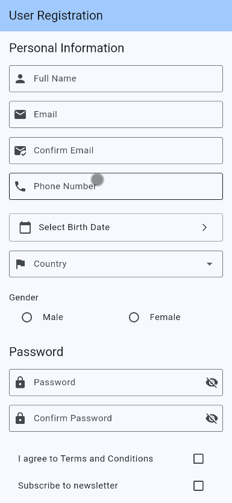
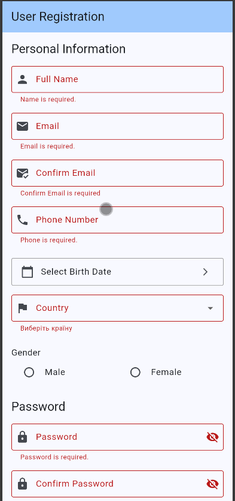
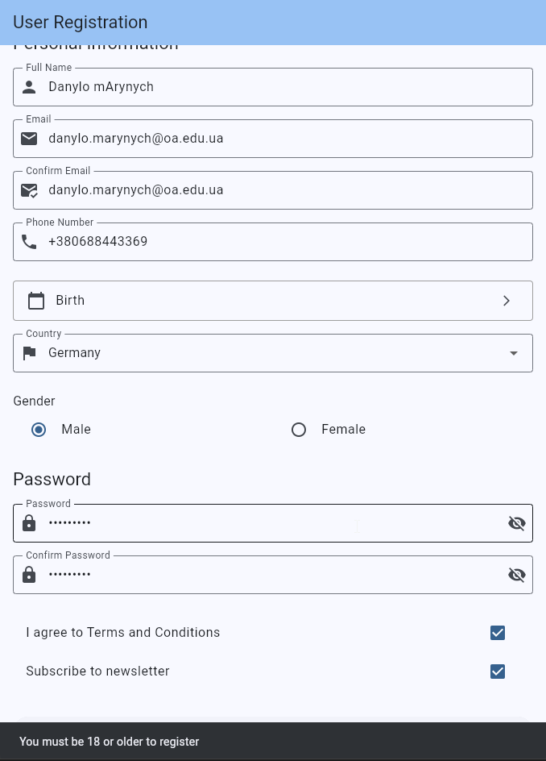
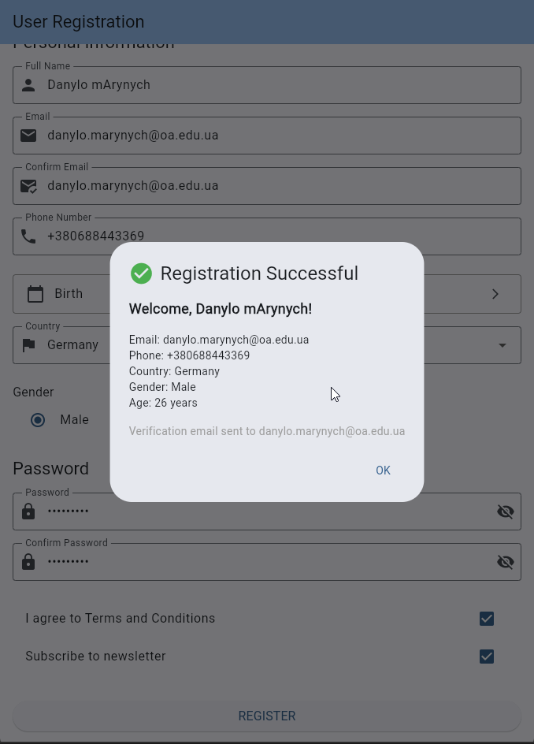

# Лабораторна робота №7: Робота з формами - User Registration Form
**Виконав:** Маринич Данило

---

## 📱 Про проєкт
Цей застосунок є повноцінним екраном реєстрації користувача з комплексною валідацією даних. Мета проєкту — навчитися працювати з віджетом `Form`, обробляти різні типи вводу та використовувати регулярні вирази (`RegExp`) для перевірки коректності даних на стороні клієнта.

### Виконані вимоги:
- ✅ **Робота з Form:** Використано `GlobalKey<FormState>` для одночасної валідації всіх полів.
- ✅ **Різноманітні поля вводу:** Реалізовано роботу з `TextFormField` (текст, email, пароль, телефон), `DropdownButtonFormField` (країна), `RadioListTile` (стать), `CheckboxListTile` (згода з умовами) та `showDatePicker` (дата народження).
- ✅ **Ізольована валідація:** Створено утилітарний клас `Validators` зі статичними методами для перевірки формату Email, українського номеру телефону (+380...) та надійності пароля (мінімум 8 символів, цифри, великі літери).
- ✅ **User Model:** Створено ООП-модель `User` з інкапсульованою логікою розрахунку віку та форматування дати.
- ✅ **UX/UI Покращення:** Реалізовано приховування/показ пароля (obscure text) та динамічний вивід результатів реєстрації через `AlertDialog`.
- ✅ 🌟 **Додаткове завдання (Варіант A):** Додано поле "Confirm Email" із cross-field валідацією (перевірка на співпадіння з основним Email).
- ✅ 🌟 **Додаткове завдання (Варіант B):** Додано бізнес-логіку перевірки віку — реєстрація блокується з виводом помилки у `SnackBar`, якщо користувачу менше ніж 18 років.

---

## 🏗 Архітектура проєкту
Логіку валідації та структури даних відділено від візуальної частини для дотримання принципів чистого коду (Clean Architecture):

- `lib/models/` 
  - `user.dart` — модель користувача з методами `get age` та `get formattedBirthDate`.
- `lib/screens/` 
  - `registration_screen.dart` — головний екран, що містить стан форми та логіку відображення помилок/успіху.
- `lib/utils/` 
  - `validators.dart` — набір чистих функцій для перевірки даних (включаючи кастомний метод `combine` для ланцюжкових перевірок).

---

## 🎓 Відповіді на ключові питання

**1. Навіщо потрібен GlobalKey<FormState>?** Він виступає унікальним ідентифікатором форми. Завдяки йому ми можемо отримати доступ до стану форми з будь-якого місця коду (наприклад, з обробника кнопки Register) і викликати метод `_formKey.currentState!.validate()`, який автоматично запустить перевірку у всіх дочірніх `TextFormField`.

**2. Чому важливо викликати dispose() для TextEditingController?** Контролери керують текстом і постійно "слухають" зміни, утримуючи ресурси в оперативній пам'яті. Якщо екран закривається, ці контролери залишаються жити в пам'яті, створюючи витік пам'яті (Memory Leak). Метод `dispose()` звільняє ці ресурси.

**3. Як працює cross-field валідація (перевірка збігу паролів/email)?** У полі "Confirm Password" (або Confirm Email) всередині функції `validator: (value)` ми звертаємось до тексту оригінального поля через `_passwordController.text` і порівнюємо їх. Якщо значення не збігаються, повертається рядок з помилкою.

**4. Як працює RegExp (регулярні вирази)?** `RegExp` дозволяє задати шаблон (патерн), якому має відповідати рядок. Наприклад, `r'^\+380\d{9}$'` перевіряє, щоб рядок починався з "+380", після чого йшло рівно 9 будь-яких цифр `\d{9}`, і на цьому рядок закінчувався `$`. Метод `hasMatch()` повертає `true`, якщо текст ідеально підходить під шаблон.

---

## 📸 Скріншоти

